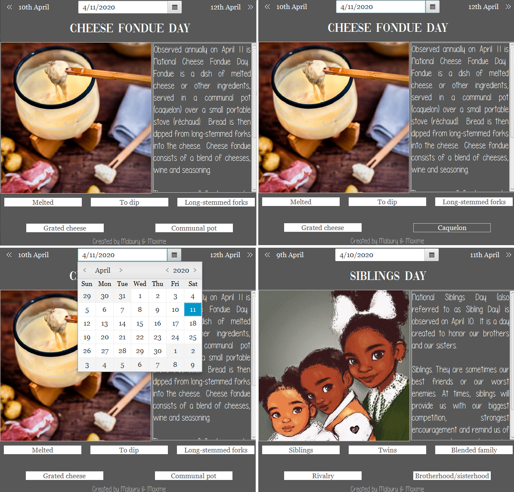

# EnglishApplication

> Le but de ce projet était de développer un outil informatique permettant d'apprendre sur la linguistique et/ou la culture anglais/d'un pays anglophone. Mon binôme et moi avons décidé de développer une application présentant, pour chaque jour, l'une des journées nationale des USA. Celle-ci est illustrée, décrite en anglais, et 5 mots de vocabulaires sont proposés (il suffit de passer la souris sur l'un de ces mots pour que la traduction française s'affiche).

En haut à gauche, on peut voir le visuel de l'application lorsqu'on la lance le 11 avril. Sur la droite, l'affichage lorsque que l'on passe la souris sur le terme "Communal pot", qui dévoile la traduction française. En bas à gauche, on remarque que l'on peut utiliser un calendrier pour accéder à n'importe quel jour facilement. Enfin en bas à droite est présenté le visuel après avoir cliqué sur la flèche "précédente". 
